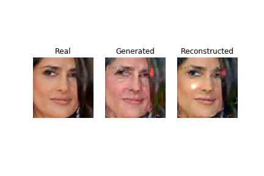
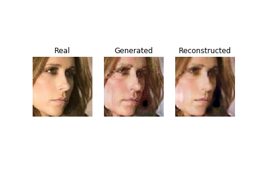
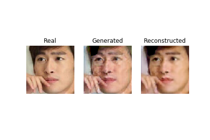
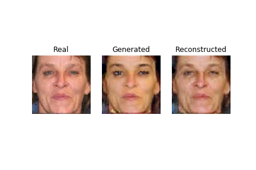
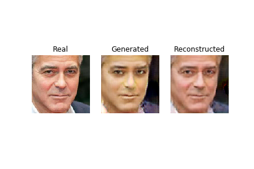
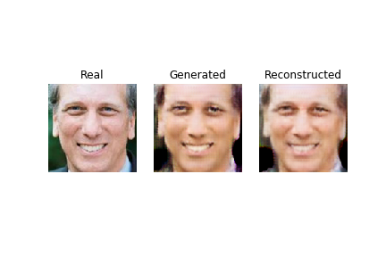

# CycleGAN for Faces Dataset

Faces Dataset Location: <https://susanqq.github.io/UTKFace/>

Original CycleGAN Implementation in PyTorch is available at <https://github.com/junyanz/pytorch-CycleGAN-and-pix2pix>


### Discriminator

For Discriminator:

- Use PatchGAN - only penalizes the structure at the scale of patches.
- PatchGAN classifies the NxN patch is real or fake
- They have fewer parameters than the full image discriminator
- PatchGAN are used in [Image to Image translation](https://arxiv.org/pdf/1611.07004.pdf)

### Generator

Generator can be one of the following two things:

```
 * Encoder : Decoder combo (UNet - uses skip connections)
 or
 * Encoder : Transformer : Decoder (Uses Residual blocks)
```

The Encoder shrinks the input image. Uses Conv layers (with strides:2).

The Transformer uses residual blocks

The Decoder expands the image with transpose Conv.

Note: each layer will use LeakyReLU and InstanceNormalization

#### Resnet block

Original paper uses **reflection padding**. Let's use **same** padding for simplicity.


## Results


### Young to Old







### Old to Young







